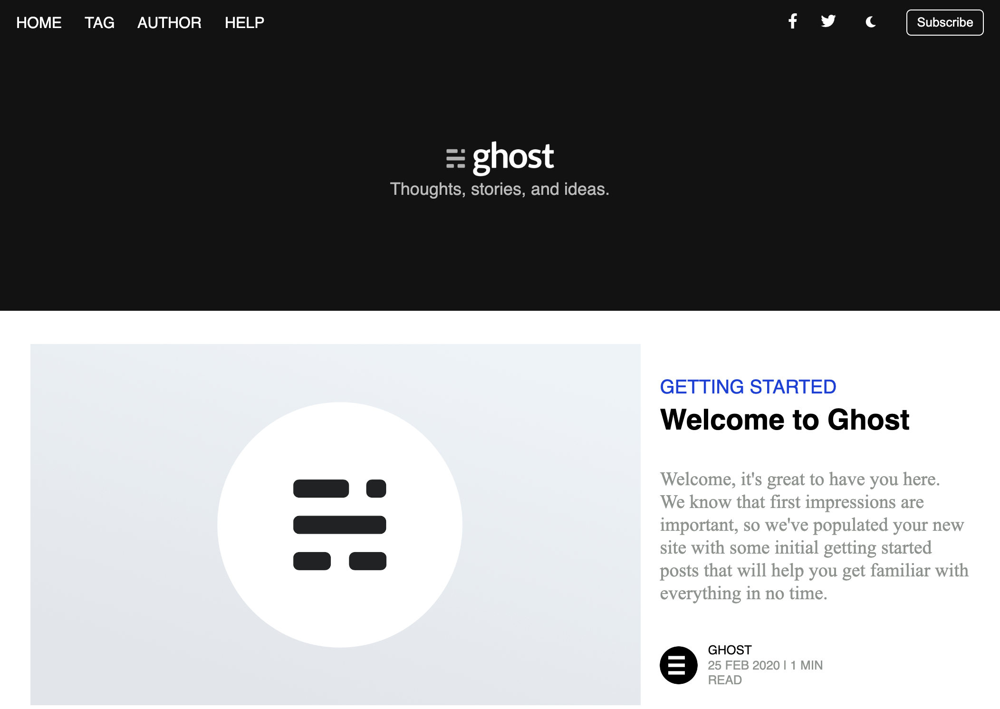

# PRD: CSS_Assignment3 – Blog Website

- Task Name: CSS_Assignment3
- Link / GitHub URL: [Github](https://github.com/Sourabhpande532/BlogFlowCSS)
- Link / Vercel URL: [Live](https://sunny-hummingbird-2cbaa3.netlify.app/)

## Objectives
1. Build a complete Blog Website using all concepts learned so far.
2. Implement navbar, main content layout, and responsive structure.
3. Apply Flexbox, positioning, and layout flow rules for clean UI.

## Key Learning
- I applied my understanding of block, inline, inline-block, and layout flows to structure the page.
- Used Flexbox for alignment, spacing, and responsive behavior across sections.
- Applied relative and absolute positioning with correct parent–child behavior.
- Focused on improving UI consistency, spacing, and component structure based on earlier revisions.

## Demo
